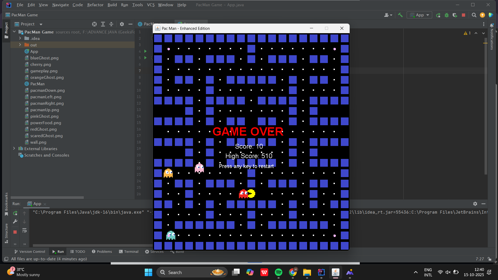

#   Pac-Man Game Java Swin

Relive the nostalgia of the classic Pac-Man, now reborn in Java Swing with a modern touch! 
Guide Pac-Man through winding mazes, munch on pellets, and dodge clever ghosts  as the challenge intensifies with every level.

This enhanced version adds a new layer of fun with power-ups, combo scoring, animated graphics, and progressive speed levels.
Developed entirely with core Java, it highlights the power of object-oriented design, real-time rendering, and event-driven game loops.

---

##  Features  

###  Core Gameplay  
- **Classic Pac-Man Mechanics:** Smooth four-directional movement using arrow keys.  
- **Intelligent Ghost AI:** Four ghosts with random pathfinding behavior.  
- **Accurate Collision Detection:** Detects walls, food, ghosts, and power-ups.  
- **Multi-Level Progression:** Infinite levels with increasing speed and difficulty.  

###  Enhanced Features  
-  **Power-Up Mode:** Eat power pellets to chase and eat ghosts for bonus points.  
-  **Combo Multiplier:** Consecutive ghost captures increase your score (200 → 400 → 600 → 800).  
-  **High Score Tracking:** Automatically stores your best score.  
-  **Animated Graphics:** Smooth Pac-Man animations and pulsing power-ups.  
-  **Pause Functionality:** Press **SPACE** to pause/resume.  
-  **Screen Wrapping:** Move across screen edges strategically.  
-  **Lives System:** Three lives displayed on the game screen.  

---

##  Screenshots 

###  Gameplay  
Experience the fast-paced classic Pac-Man action with smooth controls and ghost AI.

  


###  Power-Up Mode  
Watch Pac-Man turn the tables and chase ghosts after eating a power pellet! 

 


###  Game Over Screen  
Displays your final score and high score with a retry option.  

  


---


##  How to Play  

| Action | Key |
|:--|:--|
| Move Up |  Arrow Up |
| Move Down |  Arrow Down |
| Move Left |  Arrow Left |
| Move Right |  Arrow Right |
| Pause / Resume | SPACE |
| Exit Game | ESC |

---
 **Goal:**  
Eat all pellets while avoiding ghosts. Grab power-ups to hunt them for extra points!  

---

##  Technical Stack  
- **Language:** Java 8+  
- **GUI Framework:** Java Swing  
- **Graphics:** Java AWT (Graphics2D)  
- **Architecture:** Event-driven design pattern  
- **Game Loop:** Timer-based rendering at 20 FPS  

---

##  Requirements  
- Java Development Kit (**JDK 8 or higher**)  
- Java Runtime Environment (**JRE**)  
- No external dependencies required  

---

##  Installation & Setup  
## 1️ Prerequisites

Make sure you have the following installed:

-  **Java Development Kit (JDK 8 or higher)**
-  **Java Runtime Environment (JRE)**
-  **Any code editor or IDE** (like IntelliJ IDEA, VS Code, or NetBeans)

---

## 2️ Clone the Repository

Open your terminal and run:

```bash
git clone https://github.com/yourusername/pacman-java-game.git
cd pacman-java-game
```

---

## 3️ Compile the Game

Run this command to compile the Java files:

```bash
javac PacMan.java
```

---

## 4️ Run the Game

Start the game using:

```bash
java PacMan
```

---

## 5️ Play and Enjoy 

- Use Arrow Keys to move Pac-Man 
- Press SPACE to pause or resume 
- Collect all dots, avoid ghosts , and aim for a high score!


## Author
- Atharva Chavhan
- Gmail: atharvachavhan18@gmail.com

------------------
